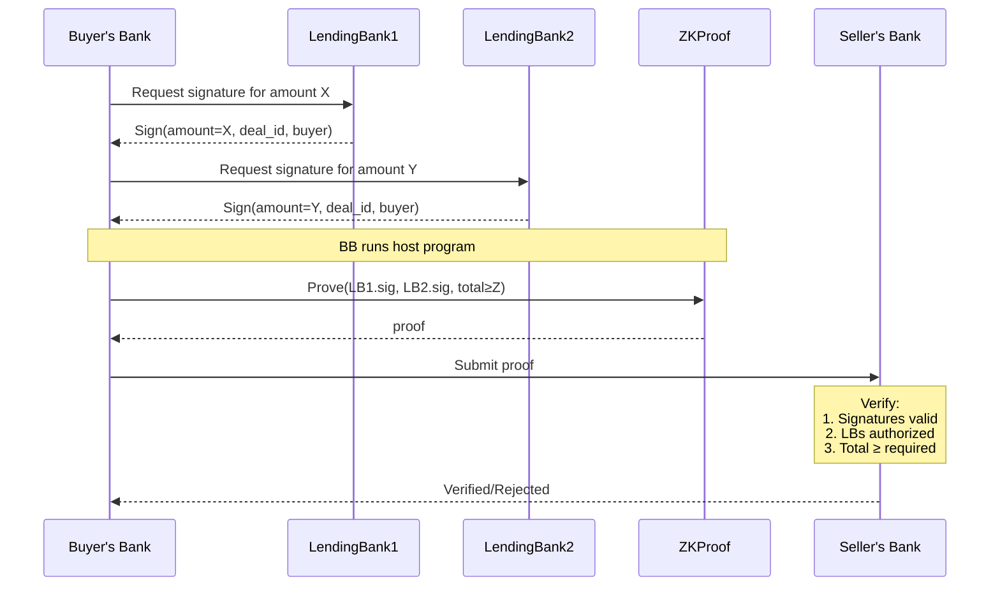

# RWZ-POF (Real World Zeroes - Proof of Financing)

A RISC0 ZKVM-based system that provides zero-knowledge verification of lending bank commitments.

## Context

In M&A auctions, buyers need to prove to the Seller's Bank (SB) that they have acquired the necessary financing to complete a deal. Traditionally, this involves naming the lending banks that have committed to providing the financing. However, revealing the identities of committed banks can disadvantage the buyer - if SB prefers another buyer who is struggling to secure financing, they could share these bank names with their preferred buyer.

## Goal

Provide assurance to the SB that lending banks within a known network of reputable banks have provided their lending commitments for a bid proposed by a specific Buyer, without revealing the identities of these lending banks.

## Roles & Operations

- **Buyer's Bank (BB)**: Runs the host program with access to their lending bank commitments, generates proofs
- **Seller's Bank (SB)**: Verifies the generated proofs using the guest program
- **Lending Banks (LB)**: Provide signed commitments to the buyer

## Implementation

### Core Components

- **Host Program** (host/src/main.rs)
  - Generates lending bank signatures for commitments
  - Creates zero-knowledge proofs
- **Guest Program** (methods/guest/src/main.rs)
  - Verifies signatures are from authorized banks
  - Verifies public keys are unique so that signatures cannot be repeated
  - Validates total committed amount meets requirements
  - Commits verified deal info to journal

## Development

See [RISC0 Getting Started Guide](https://dev.risczero.com/api/getting-started).

### Project Structure
- **core/**: Core library containing proof generation and verification logic
- **methods/**: RISC0 guest methods for zero-knowledge proofs
- **server/**: HTTP server for API integration
- **[deprecated] host/**: Original implementation (to be removed)

### Building and Testing
```bash
# Build everything
cargo build --release

# Run tests
cargo test --release
```

### Running Examples
```bash
# Run the basic example (previously in host)
# Local proving
cargo run --example basic -p rwz-pof-core

# Dev mode for rapid prototyping
RISC0_DEV_MODE=true cargo run --example basic -p rwz-pof-core

# Start the API server in development mode
RISC0_DEV_MODE=true cargo run -p rwz-pof-server
```

#### Expected output from proving:
```
Starting proof generation...
total_cycle_count: 22955819

Proof generated successfully!
Verified deal info: DealInfo { amount: 50, deal_id: "DEAL123", buyer: "buyer123" }
Verified amount: 60
Receipt verification successful!
```

### Testing the API Flow

Once the server is running (default: http://localhost:3030), test the complete flow using these commands:

```bash
# 1. Create commitment for LB1 (bank_index = 0)
curl -X POST http://localhost:3030/lb/commitment \
  -H "Content-Type: application/json" \
  -d '{"bank_index": 0, "amount": 50}' | json_pp

# 2. Create commitment for LB2 (bank_index = 1)
curl -X POST http://localhost:3030/lb/commitment \
  -H "Content-Type: application/json" \
  -d '{"bank_index": 1, "amount": 30}' | json_pp

# 3. Generate proof
curl -X POST http://localhost:3030/bb/proof \
  -H "Content-Type: application/json" \
  -d '{"required_amount": 60, "deal_id": "DEAL123"}' | json_pp

# 4. Verify proof
curl -X POST http://localhost:3030/sb/verify \
  -H "Content-Type: application/json" \
  -d '{"deal_id": "DEAL123"}' | json_pp
```

Expected successful verification response:
```json
{
   "deal_info" : {
      "amount" : 50,
      "buyer" : "buyer123",
      "deal_id" : "DEAL123"
   },
   "verified" : true
}
```

## Performance notes

On a MacBook Pro 2021 (M1 Max, 64GB) `cargo run --release` takes ~2m (incl compile). This is without any form of customization or performance work.

Currently total cycle count is ~23M. A secp256k1 signature verification is ~500k cycles (? source needed). Most expensive part is most likely serialization/deserialization.

## Sequence diagram



## Development Notes

- The server uses in-memory storage for commitments and proofs
- All endpoints use JSON for request and response bodies
- Development mode (`RISC0_DEV_MODE=true`) enables faster proving for testing
- Default deal ID is "DEAL123" if not specified
- Default buyer is "buyer123" if not specified

## Error Handling

Common error responses:
- "Not enough commitments for proof generation" - Need at least 2 commitments
- "No proof found for the deal" - No proof has been generated for the given deal_id
- "Failed to generate proof" - Proof generation failed (check required amount)

## TODO
- Integrate with glue code (e.g. UI); see [PLAN.md](PLAN.md)
- Replace deterministic test keys with separate generation
- Allow for more than two LBs
- Implement comprehensive testing, error handling, and input validation
- Experiment with remote proving capabilities
- Improve performance
- Add proper error handling to server endpoints
- Add authentication and authorization
- Add persistent storage
- Add concurrent deal support
- Add frontend UI (see PLAN.md)