# RWZ-POF (Real World Zeroes - Proof of Financing)

A RISC0 ZKVM-based system that provides zero-knowledge verification of lending bank commitments.

Created during [Edge Lanna Hackathon](https://www.edgecity.live/lanna-hackathon) in Chiang Mai, 2024. See [rwz-pof](https://hackmd.io/@ml-sudo/rwz-pof) for more details on the origin of this idea. Also see this [demo video](https://www.youtube.com/watch?v=HoUy5eReWPY) for illustration of the problem and example usage.

## Context

In M&A auctions, buyers need to prove to the Seller's Bank (SB) that they have acquired the necessary financing to complete a deal. Traditionally, this involves naming the lending banks that have committed to providing the financing. However, revealing the identities of committed banks can disadvantage the buyer - if SB prefers another buyer who is struggling to secure financing, they could share these bank names with their preferred buyer.

## Goal

Provide assurance to the SB that lending banks within a known network of reputable banks have provided their lending commitments for a bid proposed by a specific Buyer, without revealing the identities of these lending banks.

## Roles & Operations

- **Buyer's Bank (BB)**: Runs the host program with access to their lending bank commitments, generates proofs
- **Seller's Bank (SB)**: Verifies the generated proofs using the guest program
- **Lending Banks (LB)**: Provide signed commitments to the buyer

## Implementation

### Core Components
- **core/**: Core library containing proof generation and verification logic
- **methods/**: RISC0 guest methods for zero-knowledge proofs
  - Verifies signatures from authorized banks
  - Validates unique public keys and total committed amount
  - Commits verified deal info to journal
- **server/**: HTTP server for API integration with async proof generation
- **frontend/**: Next.js web interface for interacting with the system

### Building and Running

See [RISC0 Getting Started Guide](https://dev.risczero.com/api/getting-started).

```bash
# Build everything
cargo build --release

# Run tests
cargo test --release

# Run the basic example (without server)
cargo run --example basic -p rwz-pof-core

# Run example in dev mode (faster proving)
RISC0_DEV_MODE=true cargo run --example basic -p rwz-pof-core

# Start API server in development mode (faster proving)
RISC0_DEV_MODE=true cargo run -p rwz-pof-server

# Start frontend development server
cd frontend
npm install
npm run dev
```

The frontend will be available at http://localhost:3000. Ensure the backend server is running on port 3030 before using the frontend.

### Testing the API Flow

The server supports both synchronous and asynchronous proof generation. The async mode is recommended for production use due to long proving times (~2m on M1 Max).

```bash
# 1. Create commitment for LB1 (bank_index = 0)
curl -X POST http://localhost:3030/lb/commitment \
  -H "Content-Type: application/json" \
  -d '{"bank_index": 0, "amount": 50}' | json_pp

# 2. Create commitment for LB2 (bank_index = 1)
curl -X POST http://localhost:3030/lb/commitment \
  -H "Content-Type: application/json" \
  -d '{"bank_index": 1, "amount": 30}' | json_pp

# Option A: Synchronous Flow
# 3A. Generate proof (synchronous)
curl -X POST http://localhost:3030/bb/proof \
  -H "Content-Type: application/json" \
  -d '{"required_amount": 60, "deal_id": "DEAL123"}' | json_pp

# Option B: Asynchronous Flow
# 3B. Start async proof generation
curl -X POST http://localhost:3030/proofs/async \
  -H "Content-Type: application/json" \
  -d '{"required_amount": 60, "deal_id": "DEAL123"}' | json_pp

# 4B. Check job status (replace JOB_ID with id from previous response)
curl -X GET http://localhost:3030/proofs/async/JOB_ID | json_pp

# 5. Verify proof (for both flows, after completion)
curl -X POST http://localhost:3030/sb/verify \
  -H "Content-Type: application/json" \
  -d '{"deal_id": "DEAL123"}' | json_pp
```

#### Expected Responses

Proof verification (sync & async final):
```json
{
   "deal_info" : {
      "amount" : 50,
      "buyer" : "buyer123",
      "deal_id" : "DEAL123"
   },
   "verified" : true
}
```

Async job status:
```json
{
    "status": "InProgress",
    "created_at": "2024-11-05T02:58:26.768278Z",
    "updated_at": "2024-11-05T02:58:26.768316Z"
}
```

When completed:
```json
{
    "status": "Completed",
    "created_at": "2024-11-05T02:58:26.768278Z",
    "updated_at": "2024-11-05T02:58:30.123456Z",
    "proof": {
        "verified": true,
        "deal_info": {
            "amount": 50,
            "buyer": "buyer123",
            "deal_id": "DEAL123"
        }
    }
}
```

## Sequence Diagram

```mermaid
sequenceDiagram
    participant BB as Buyer's Bank
    participant LB1 as LendingBank1
    participant LB2 as LendingBank2
    participant ZK as ZKProof
    participant SB as Seller's Bank

    BB->>LB1: Request signature for amount X
    LB1-->>BB: Sign(amount=X, deal_id, buyer)
    BB->>LB2: Request signature for amount Y
    LB2-->>BB: Sign(amount=Y, deal_id, buyer)

    Note over BB,ZK: BB starts async proof generation
    BB->>ZK: Create proof job
    ZK-->>BB: Job ID
    BB->>ZK: Poll status
    ZK-->>BB: Status (InProgress/Completed)

    BB->>SB: Submit verified proof
    Note over SB: Verify:<br/>1. Signatures valid<br/>2. LBs authorized<br/>3. Total ≥ required
    SB-->>BB: Verified/Rejected
```



## Notes & Limitations
- In-memory storage only (no persistence)
- All endpoints use JSON for request/response
- Development mode (`RISC0_DEV_MODE=true`) for faster proving
- Default values: deal_id="DEAL123", buyer="buyer123"
- Proof generation takes ~2m on M1 Max
- Total cycle count ~23M (mostly serialization overhead)

## Common Errors
- "Not enough commitments" - Need 2 commitments
- "No proof found" - Missing/incomplete proof
- "Failed to generate proof" - Check required amount

## TODO
- Replace deterministic test keys
- Support >2 lending banks
- Add persistent storage
- Add authentication/authorization
- Improve performance
- Add frontend UI